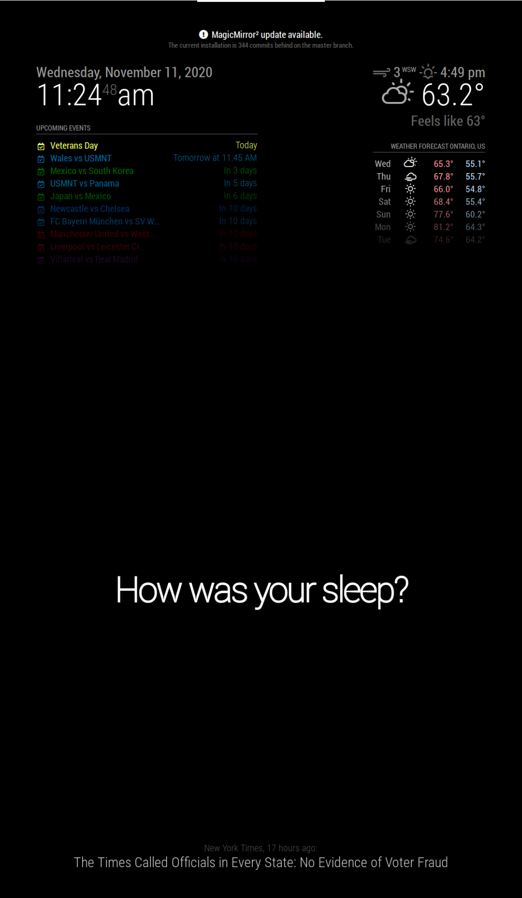
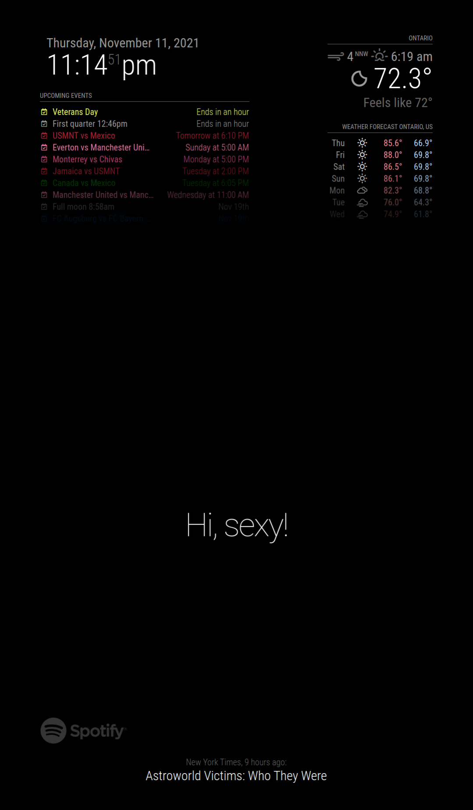
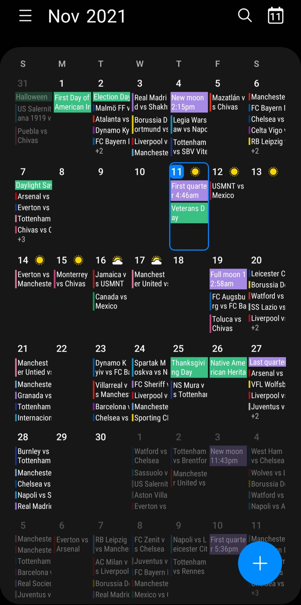
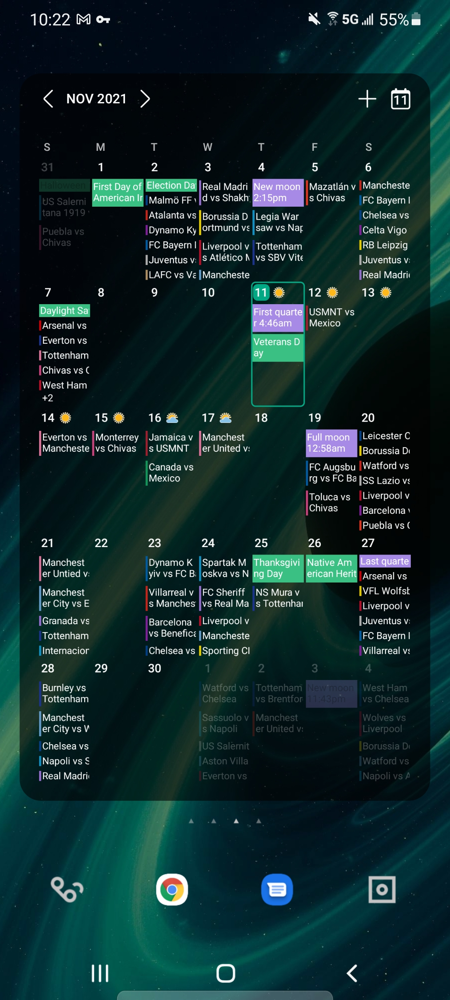

# MagicMirror

## Table of Contents
- [ Description ](#description)
- [ Live ](#live)
- [ Screenshoots ](#screenshoots)
- [ Installation ](#installation)
- [ Links ](#links)
- [ Technologies ](#technologies)
- [ License ](#license)
- [ Portfolio ](#portfolio)

# Description

The Magic Mirror project, is an application displayed into a Double-Sided Mirror reflecting an ongoing stream of Data via a Raspberry Pi 3. Personalized  with results for the Weather, Date, Time, Headlining News, Now Playing Spotify Display and Calendar/Scheduler updating continuously for the family to experience publicly. Integrated with Google Calendar, and Samsung Calendar, to display full
Calendar Scheduler for mobile devices.

Calendar configured to display Football ⚽ Calendar of the Top 6 English Premier League Clubs

| Arsenal, Chelsea, Liverpool, Manchester United, Manchester City, Tottenham |

Calendar also Includes Calendars for:

| Real Madrid, Barcelona, Bayern München, Borussia Dortmund, Juventus, Napoli, LAFC, Chivas, Chivas Femenil, USMNT, USWNT,FMF Mexico, FMF Mexico Femenil, Manchester United F |

Schedule includes League, Cup, Champions League | European Cups and International matches.

**MagicMirror²** is an open source modular smart mirror platform. With a growing list of installable modules, the **MagicMirror²** allows you to convert your hallway or bathroom mirror into your personal assistant. **MagicMirror²** is built by the creator of [the original MagicMirror](https://michaelteeuw.nl/tagged/magicmirror) with the incredible help of a [growing community of contributors](https://github.com/MichMich/MagicMirror/graphs/contributors).

MagicMirror² focuses on a modular plugin system and uses [Electron](https://www.electronjs.org/) as an application wrapper. So no more web server or browser installs necessary!

# Screenshots

 

 

 

 

# Installation

For the full documentation including **[installation instructions](https://docs.magicmirror.builders/getting-started/installation.html)**, please visit our dedicated documentation website: [https://docs.magicmirror.builders](https://docs.magicmirror.builders).

## Links

- Website: [https://magicmirror.builders](https://magicmirror.builders)
- Documentation: [https://docs.magicmirror.builders](https://docs.magicmirror.builders)
- Forum: [https://forum.magicmirror.builders](https://forum.magicmirror.builders)
- Discord: [https://discord.gg/J5BAtvx](https://discord.gg/J5BAtvx)
- Blog: [https://michaelteeuw.nl/tagged/magicmirror](https://michaelteeuw.nl/tagged/magicmirror)
- Donations: [https://magicmirror.builders/#donate](https://magicmirror.builders/#donate)
 
 

# Technologies

| Client side             |                   |                  |
| -------------           | -------------     | --------------   |
| colors                  | CSS               | JavaScript       |
| Fonts                   | eslint            | prettier-quick   |
| styled-components       | testing-library   | RandomUser API   |
| stylelint               | stylelint-prettier| Test             |

 

| Server side             |                   |                  |
| -------------           | -------------     | --------------   |
| Express.js              | Express IP Filter | Moment.js        |
| ical                    | node-ical         | Husky            |
| Express-basic-auth      | Mocha             | NYTimes RSS API  |
| router-dom              | Google Calendar   | RaspBerry Pi 3   |

 

# License

 

# Portfotlio
My personal portfolio which features some of my Github Projects as well as my Resume and Technical Skills. [💼](https://cdmmandalorian.github.io/AEGcodesPortfolio/ "Link AEGcodes Portfolio").
